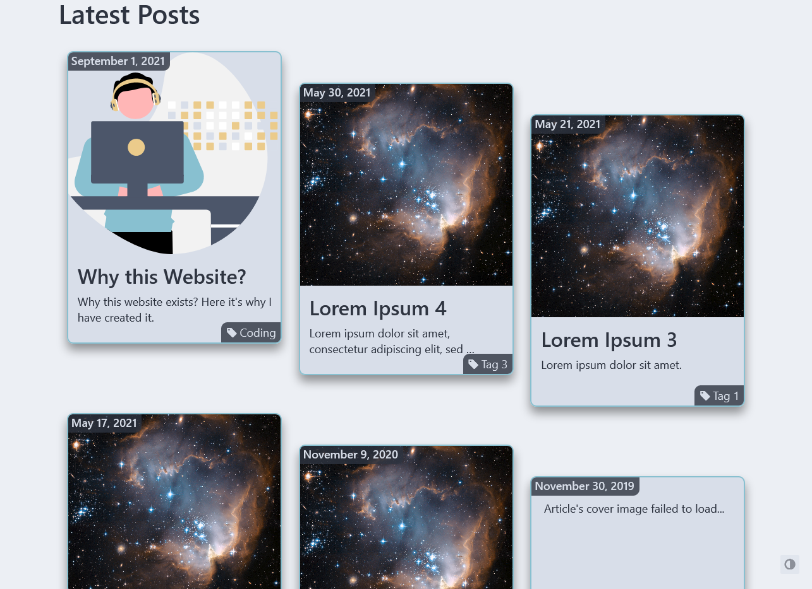

# My personal website
It's online on [lorenzobinda.com](https://lorenzobinda.com/)
It contains articles and guides created by me. It's focused on technology and productivity tools. Here I express my personal opinions, I hope it will be useful also for others. 

Created with the Hugo static website generator, starting from the hugo-coder theme. 

All made by me in my spare time. The journey has been an extremely valuable way to really go deep and put my coding competences into practice.

## Screenshots
These are some screenshots about the work-in-progress. They are took with the dark-mode, but also a classic light-mode is included. The website will be available both in English and Italian.
### Homepage
Dark theme | Light theme
--- | ---
 | 

##### Italian translation
Tema scuro | Tema chiaro
--- | ---
 | 

### Blog list
All posts with dark theme | All posts with light theme
--- | ---
 | 

### Books section
Books' list with dark theme | Books' list with light theme
--- | ---
 | 

### Contacts page
About me and my contacts with dark theme | About me and my contacts with light theme
--- | ---
 | 

### Error 404 page
"404 page not found" with dark theme | "404 page not found" with light theme
--- | ---
 | 

---
Acknowledgements:
- I got the inspiration from [Riccardo Palombo](https://riccardo.im/)
- I started creating it from the Hugo [Coder](https://themes.gohugo.io/themes/hugo-coder/) theme
- I learnt the basis of Hugo from [Mike Dane](https://www.youtube.com/watch?v=qtIqKaDlqXo&list=PLLAZ4kZ9dFpOnyRlyS-liKL5ReHDcj4G3) on Youtube 
- I learnt how to create and publish it from [Chris Stayte](https://www.youtube.com/watch?v=5aajv-2YZYM&list=PL-Kz5P-mYdMgAJDmRJquyMHfdaIOD-3oj) on Youtube